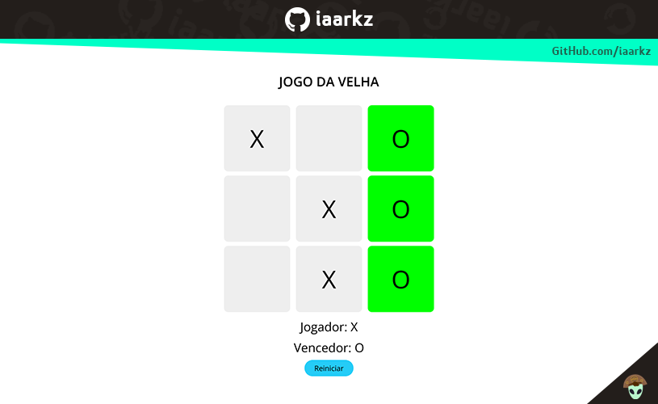
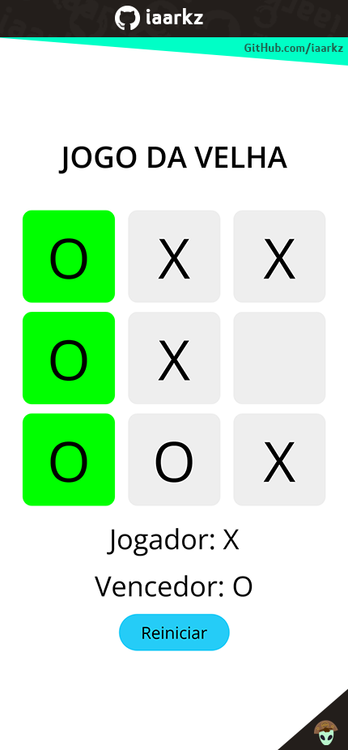

# Jogo da Velha

Jogo da velha proposto pelo pelo bootcamp Órbi Web Games Developer em parceria com a [Digital Innovation One](https://web.dio.me/).

## Tecnologias

- HTML, CSS e JavaScript;
- Responsividade para web, tablets e phones.

## Para rodar o projeto

Basta baixar o projeto e rodar abrir o index.html em um navegador da preferência ou abrir esse [link para o jogo da velha](https://iaarkz.github.io/jogo-da-velha-dio/).

## Exemplos do jogo:

### 
 Responsive Design Web 

### 
 Responsive Design Tablet 

### 
 Responsive Design Phone 

&nbsp;
&nbsp;

## Para mais projetos construidos com a DIO

[Repositório Guia de Projetos DIO](https://github.com/iaarkz/guia-projetos-dio)
